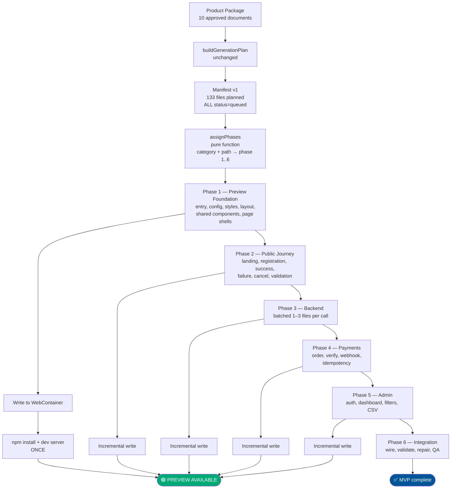
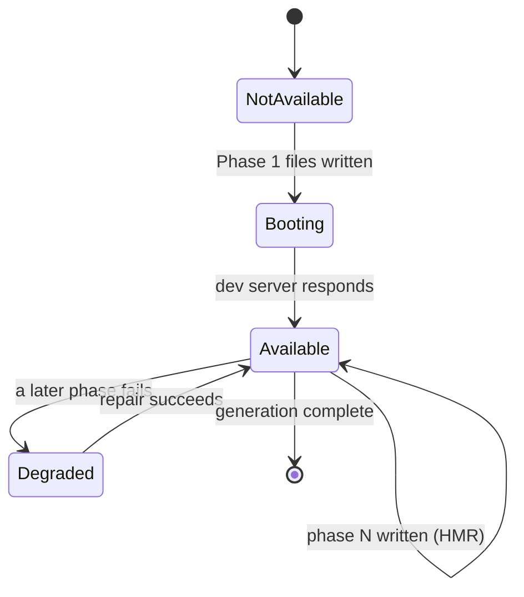

# Sprint 99 — Progressive Application Generation
## Technical Design & Implementation Roadmap

**Status:** Checkpoints A and B implemented, unit-verified and verified in a controlled run. Checkpoints C–D not started.
**Implementation started:** 28 July 2026
**Author:** Claude (Claude Code)
**Date:** 28 July 2026
**Baseline:** `builders-v2` @ `b99a14a`
**Motivated by:** Acceptance Round 2 (AR2-BUG-006, AR2-BUG-007, AR2-BUG-008)

---

## 0. Design stance

This is an **evolution, not a rewrite**. Three constraints shape every decision below:

1. **Reuse what works.** The Requirements → Product Package → 9-role pipeline is not touched. The
   manifest, generated-file, versioning and resume tables are not replaced.
2. **No new AI calls to compute structure.** Phase membership is *derived* from data the plan already
   has (`ManifestFileCategory` + path), not asked of a model.
3. **No migration unless earned.** §11 shows the design lands with **zero schema changes**.

The single most important behavioural change is not the phases — it is that **preview availability is
decoupled from generation completion**.

---

## 1. Architecture diagram



**What changed structurally:** one `for (const module of plan.backendModules)` loop and a
monolithic "generate everything → validate → write once" tail become a **phase runner** that writes
and previews after each phase.

---

## 2. Generation lifecycle

### Today

```
plan → generate ALL (~133 files) → validate ALL → write ALL → install → preview
```

Preview appears at t≈30–60 min, or never (AR2-BUG-008).

### Proposed

```
plan → assignPhases
  ↓
for each phase 1..6:
    activate phase files      (queued → pending)
    generate in small batches (1–3 files per AI call)
    guard: zero output = failure          ← AR2-BUG-008
    write phase output to WebContainer
    if phase === 1: install + launch dev server   → PREVIEW AVAILABLE
    else:           HMR picks up new files        → PREVIEW UPDATES
    mark phase complete
  ↓
phase 6 → full validation + repair + QA → complete
```

Preview appears at **t≈2–3 min** and improves monotonically.

### Stage enum

`GenerationStage` gains phase-aware members while **keeping every existing member** so no consumer
breaks (`STAGE_GROUP_LABELS`, `STAGE_TIMELINE_ID` and the workspace `currentStage` string all keep
working):

```ts
| 'phase-foundation' | 'phase-public' | 'phase-backend'
| 'phase-payments'   | 'phase-admin'  | 'phase-integration'
```

Existing members (`generating-pages`, `generating-backend`, …) remain valid and are emitted as
sub-progress within a phase, so timeline/resume code that matches on them continues to function.

---

## 3. Phase definitions

Phase membership is a **pure function of data already in the manifest** — no model call, no new
column:

```ts
function phaseForFile(file: ApplicationManifestFile): 1|2|3|4|5|6
```

| Phase | Name | Selection rule | Typical count |
|---|---|---|---|
| **1** | Preview Foundation | `category ∈ {entry, config, styles}` + `components` + page **shells** for the entry route | ~12–20 |
| **2** | Public Journey | `category = pages` where route is public (landing, register, success, failure, cancel) + their `services`/`types` | ~14 |
| **3** | Backend | `category = backend` for modules **not** payment- or admin-owned | ~18 |
| **4** | Payments | `category = backend` where the module's `featureIds` intersect payment features | ~18 |
| **5** | Admin | `category = pages` for admin routes + `category = backend` for admin modules | ~20 |
| **6** | Integration | remainder + `documentation` + wiring/validation/repair/QA | ~10 |

**Payment/admin classification** uses the module's existing `featureIds` and `apiEndpoints`
(`BackendModulePlan`) — already resolved by `resolveBackendModules`. Classification is by explicit
keyword match on endpoint path and feature id, with an **unmatched module defaulting to Phase 3**, so
a project without payments simply has an empty Phase 4 (skipped, not failed).

**Degradation rule:** any phase with zero files is marked `skipped` and the runner advances. A
project with no backend has phases 3–5 empty and still previews at Phase 1.

---

## 4. Manifest changes

**No schema migration.** The existing `ManifestFileStatus` already carries everything needed:

```
queued     → planned, NOT in the active phase   (the "master plan")
pending    → activated, awaiting its batch      (the "current active phase")
generating → AI call in flight
generated  → content persisted
validated  → passed validation
complete   → written to workspace
failed / skipped / superseded → unchanged
```

Today every planned file is written as `pending` up front, which is exactly why the dashboard shows
`0 / 133`. The change is: **plan-time writes `queued`; the phase runner promotes `queued → pending`
one phase at a time.**

Two integrity fixes ride along:

- **`total_files` is recomputed** whenever manifest file rows are inserted, closing the 127-vs-133
  drift. Same column, correct value — no schema change.
- **Phase completion is derived**, not stored: a phase is complete when no file in it is `queued`,
  `pending`, `generating` or `failed`. This keeps resume stateless and avoids a new column.

---

## 5. Workspace update strategy

`writeGeneratedProjectToWebContainer(project)` currently takes a whole `GeneratedProject`. It gains a
sibling rather than a rewrite:

```ts
writeGeneratedFilesToWebContainer(files: GeneratedFile[]): Promise<void>
```

The existing whole-project function becomes a one-line wrapper over it, so every current caller is
unaffected.

| Concern | Decision |
|---|---|
| When | After each phase completes |
| What | Only that phase's files (delta write) |
| Conflicts | Existing `detectFileOwnershipConflicts` / `protectedPaths` logic applies unchanged |
| Install | **Once**, after Phase 1 only |
| Later phases | No reinstall; Vite HMR picks up new files |
| New dependency mid-run | If a later phase introduces a package.json change, re-run install for that phase only (rare; detected by comparing package.json checksum) |

---

## 6. Preview lifecycle



- The **Preview button enables the moment Phase 1 boots**, independent of overall progress.
- Banner: *"Preview Ready — Builders is continuing generation."*
- A failure in phases 2–6 **never tears down a working preview**; it degrades that feature only.
- `workspaceState.previewAvailable` is set at Phase 1, not at `complete` — this is the field the
  dashboard already reads.

---

## 7. Resume lifecycle

Resume becomes materially simpler because phases are ordered and self-describing:

1. Load the active manifest (never create a new version on resume — preserves the verified
   Round 2 behaviour where v1 was correctly reused).
2. Find the **lowest incomplete phase**; every phase below it is proven complete by file status.
3. Reuse any file that is `validated`/`complete` **and** whose checksum still matches — the existing
   `getReusableFileContent` path, unchanged.
4. Regenerate only `queued`/`pending`/`failed` files **in the current phase**.
5. Rewrite the workspace from all reusable content, then continue forward.

This directly fixes the Round 2 observation that 6 shared components were needlessly regenerated to
v2: components are Phase 1, and a completed Phase 1 is never re-entered.

---

## 8. Retry strategy

Retries become **layered and bounded**, replacing the flat 9-attempt budget that Round 2 burned
against a hard billing error:

| Level | Scope | Budget | On exhaustion |
|---|---|---|---|
| Call | one batch | 2 retries (existing `generateRoleWithRecovery`) | batch fails |
| Batch | 1–3 files | 1 retry with a smaller batch (split) | files marked `failed` with `last_error` |
| Phase | whole phase | 0 automatic; operator-initiated | phase marked `failed` |

**Non-retryable classification (new, and the direct lesson of the credit outage):** provider errors
matching billing/authentication/quota are classified `non-retryable` and **abort immediately** with a
structured error. No file-level retry, no phase retry. Round 2 spent ~800 futile calls for want of
this single check.

**Token budget:** batches of 1–3 files against the existing 8192 ceiling, rather than six files that
provably cannot fit (`finishReason: "length"` reproduced in the AR2-BUG-008 investigation). This is
what actually fixes backend generation.

---

## 9. Failure handling

The three AR2 defects are resolved here, by design rather than as patches:

**AR2-BUG-008 — zero output cannot be success.**
Every batch asserts a post-condition: if `acceptedFiles.length === 0` while paths were expected, the
batch **fails** with a structured error naming the module, the expected paths and the paths actually
returned; `onStageFailed` runs so `last_error` is populated. A phase cannot complete while any of its
files are `queued`/`pending`/`generating`.

**AR2-BUG-007 — internal failures must not read as operator cancellation.**
`GenerationResult` gains a **termination reason**:

```ts
terminationReason?: 'operator-cancelled' | 'provider-error' | 'phase-failed' | 'internal-abort'
```

`cancelled: true` is set **only** for `'operator-cancelled'`. `useCodeGeneration`'s cancel branch
keys off the reason, not the abort signal alone, so a mass failure persists `failed` with a real
`last_error` — never "Generation stopped by the operator". Sprint 98C's `cancelled` state is
preserved and becomes *more* trustworthy, because only genuine operator stops reach it.

**AR2-BUG-006 — phase-scoped counters.**
Progress is reported per active phase, not against the total plan.

---

## 10. New progress model

```
Preview Foundation     12 / 12    ✓ Complete    → Preview Available
Public Registration     6 / 14    ⟳ Generating
Backend                 3 / 18    ⟳ Generating
Payments                          ○ Pending
Admin                             ○ Pending
Integration                       ○ Pending
```

Each row derives from file statuses within that phase. `0 / 133` disappears entirely. Crucially,
**"Complete" means written to the workspace**, so the number the operator sees matches what the
preview actually contains.

---

## 11. Migration impact

**None. No schema migration is required.**

| Candidate change | Needed? | Why not |
|---|---|---|
| `phase` column on manifest files | No | Derived by a pure function from `category` + path |
| Phase state table | No | Derived from file statuses |
| New file-status values | No | `queued` already exists and is unused for this purpose |
| `total_files` correction | No | Same column, corrected value at write time |
| Backfill of existing manifests | No | Legacy manifests have all files `pending` → treated as a single fully-activated phase (see §12) |

If a future sprint wants phase analytics, a nullable `phase` column can be added then — deliberately
deferred rather than speculatively added.

---

## 12. Backward compatibility

| Surface | Behaviour |
|---|---|
| Existing manifests (all `pending`) | Interpreted as "one phase, already activated" — generates exactly as today |
| `GenerationStage` consumers | All existing members retained; new members are additive |
| `writeGeneratedProjectToWebContainer` | Retained as a wrapper; no caller changes |
| Product Package / 9 roles | Untouched |
| Sprint 98C `cancelled` state | Preserved and made more accurate |
| Sprint 98A schema guard, manifest RPC | Untouched |
| Projects with no backend / no payments | Empty phases skipped, not failed |
| Quick Build | Untouched (separate lifecycle) |

The phase runner is additive: with a single phase containing every file, it reduces to today's
behaviour.

---

## 13. Testing strategy

**Unit**
- `phaseForFile` classification incl. unmatched-module → Phase 3 default
- Phase completion predicate; empty phase → `skipped`
- Non-retryable provider-error classification (billing/auth/quota)
- `terminationReason` mapping → `cancelled` only for operator stops

**Regression (the Round 2 defects — each must fail before the fix and pass after)**
- Backend batch returns **zero** files → run fails, `last_error` populated, stage not complete
- Batch returns **wrong paths** → error names expected vs returned
- Batch returns correct paths → all files persist with `latest_version > 0`
- Truncated-then-recovered response → files persist
- Mass failure → status `failed`, **never** "stopped by the operator"
- Phase counters reflect the active phase, not 133

**Integration**
- Phase 1 completes → workspace written → install → preview available, with phases 2–6 still `queued`
- Resume mid-Phase-3 regenerates only Phase 3; phases 1–2 untouched (no v2 bump)
- Reused files keep `generation_attempts` and `latest_version` unchanged

**Live**
One RunRide generation: preview available in ≤3 min; a backend module produces six persisted rows;
`total_files` matches child-row count.

---

## 14. Acceptance criteria

1. Preview is available **within 3 minutes** of clicking Generate Application.
2. Preview updates after every completed phase and is never torn down by a later failure.
3. No AI call is asked for more than 3 files; no `finishReason: "length"` on a normal batch.
4. A stage producing zero files **fails** with a populated `last_error`.
5. No internal failure is ever recorded as "Generation stopped by the operator".
6. Progress is reported per phase; `0 / 133` no longer appears.
7. Billing/auth errors abort immediately — no repeated paid retries.
8. Resume regenerates only the current phase; validated files are reused.
9. Manifest `total_files` always equals its child-row count.
10. A full RunRide generation completes with all backend, payment and admin files persisted.
11. No schema migration required; existing projects still generate.

---

## 15. Risks

| # | Risk | Likelihood | Impact | Mitigation |
|---|---|---|---|---|
| R1 | Smaller batches ⇒ **more AI calls**, so more total requests | High | Cost/latency | Offset by no wasted 9× retries and by truncation elimination; net token use expected **lower**, but must be measured in live verification and reported |
| R2 | Phase 1 boots but app is visibly incomplete | Medium | UX confusion | Explicit banner; Phase 1 must include a coherent shell, not fragments |
| R3 | Cross-phase imports break the preview mid-run | Medium | Broken preview | Phase 1 ships shells with no imports from later phases; Phase 6 repairs imports |
| R4 | Phase classification misroutes a file | Medium | Wrong ordering | Pure function, unit-tested; unmatched defaults to Phase 3 |
| R5 | HMR fails to pick up new files | Low | Stale preview | Fall back to explicit reload after a phase write |
| R6 | Derived phase state proves too weak for analytics | Low | Rework | Accepted deliberately; a nullable column can be added later |
| R7 | Scope creep into a rewrite | Medium | Sprint overrun | Roadmap below is staged so Stage 1+2 alone deliver the headline outcome |

---

## 16. Implementation roadmap

Ordered so that **value lands early** and each stage is independently shippable.

| Stage | Scope | Delivers | Est. |
|---|---|---|---|
| **1** | Backend batching (1–3 files) + zero-output guard + non-retryable provider classification | **Fixes AR2-BUG-008** — backend actually generates | S |
| **2** | `terminationReason` plumbing | **Fixes AR2-BUG-007** | XS |
| **3** | `phaseForFile`, `queued` gating, phase runner over existing stages | Ordered generation, resume by phase | M |
| **4** | Incremental workspace write + Phase 1 install/preview | **Preview in ≤3 min** — the headline goal | M |
| **5** | Phase-scoped progress UI | **Fixes AR2-BUG-006** | S |
| **6** | `total_files` recompute + resume hardening | Manifest integrity | XS |
| **7** | Regression + integration tests, live RunRide verification | Acceptance criteria met | M |

**Recommended first increment: Stages 1 + 2.** They are small, they unblock the Round 2 blocker, and
they are independently verifiable — a full RunRide generation that actually produces backend files
would prove the fix before any architectural work begins.

---

## 17. What this design deliberately does NOT do

- No change to Requirements, Product Package or the 9 AI roles
- No new database tables or columns
- No replacement of the manifest, versioning or resume machinery
- No parallel/concurrent phase execution (sequential is sufficient and far easier to reason about)
- No per-file AI calls (batches of 1–3, not 1)
- No new provider abstraction or queueing infrastructure


---

## 18. Implementation record — Checkpoint A (28 July 2026)

**Delivered: Checkpoint A only.** Checkpoints B (phased generation), C (early preview) and D
(progress + manifest integrity) are **not implemented**. No live RunRide verification was run.

### What was built

| File | Change |
|---|---|
| `app/lib/code-generation/providerErrors.ts` | **New.** Classifies provider errors `non-retryable` (billing/auth/quota) vs `retryable` (rate limit, overload, truncation). `isTruncatedOutput` detects `finishReason: 'length'`. |
| `app/lib/backend-generation/backendModuleBatches.ts` | **New.** Splits a module's six files into three ordered 2-file batches (`contract`, `data`, `surface`); `splitBatch` halves a batch to single files for the one permitted retry. |
| `app/lib/code-generation/prompts.ts` | Added `buildBackendModuleBatchPrompt` — asks for the batch's 1–2 files while showing the full six-path contract as context. |
| `app/lib/code-generation/codeGenerationTypes.ts` | Added `TerminationReason`; `cancelled` now documented as operator-only. |
| `app/lib/code-generation/generationPipeline.ts` | Backend stage rewritten to batch; zero-accepted-files now **fails** with a structured error; non-retryable provider errors abort the run; `terminationReason` on every termination path; `callForFiles` surfaces the failure `kind`. |
| `app/lib/hooks/useCodeGeneration.ts` | Cancel branch requires `terminationReason === 'operator-cancelled'`. |

### Deviations from the design

1. **Batch size is 2, not 1–3.** The design allowed 1–3; three ordered pairs proved the natural
   split along the module's own layering, and keeps each request comfortably inside the ceiling.
2. **Retry ordering.** The recovery layer's existing same-size retries run *first*; the pipeline's
   batch split is the fallback once those are exhausted. This was not spelled out in the design and
   is what the regression test now encodes.
3. **An existing Sprint 79 test was amended.** It asserted that a module failing with
   `'model quota exceeded'` does not abort the pipeline. Sprint 99 deliberately makes quota errors
   non-retryable and aborting, so the test now uses a transient error (`socket hang up`) to preserve
   its original intent; the abort-on-quota path is covered by the new spec.

### Test evidence

- New: `providerErrors.spec.ts` (17 cases, incl. the verbatim Round 2 billing string),
  `backendModuleBatches.spec.ts` (6), `backendBatchGeneration.spec.ts` (7 pipeline-level).
- Added `useCodeGeneration.cancellation.spec.ts` case: an internal abort must persist `failed`
  with a real `lastError` and must not emit `generation_cancelled`.
- **138 tests passing** across `code-generation/`, `backend-generation/` and the cancellation spec.
- TypeScript clean; lint 0 errors (41 pre-existing warnings).

### Not done

Checkpoints B, C and D, and all live verification. AR2-BUG-006 (progress counters) is untouched.


---

## 19. Checkpoint A — controlled live verification (28 July 2026)

One representative backend module generated through the real batch path against the real provider.
Deliberately narrow: only backend batch prompts reached the provider (all other stages were answered
from a local stub), and the file hooks recorded in memory only — **no BuildersDB rows were written**,
so the Acceptance Round 2 evidence is untouched.

**Module:** `FEAT-001` — a normal module: not payments, not admin.

| Batch | Files asked | HTTP | finishReason | Returned | Duration |
|---|---|---|---|---|---|
| 1 — contract | `types.ts`, `validators.ts` | 200 | **stop** | exactly those 2 | 20.8s |
| 2 — data | `repository.ts`, `service.ts` | 200 | **stop** | exactly those 2 | 18.3s |
| 3 — surface | `routes.ts`, `api/index.ts` | 200 | **stop** | exactly those 2 | 8.2s |

**3 AI calls, 2 files each.** All six files persisted at version 1 with non-empty content
(641 / 2,737 / 1,321 / 942 / 1,333 / 95 chars). Zero stage failures, zero backend errors, zero
warnings (nothing unexpected returned, so nothing dropped). `cancelled` undefined and
`terminationReason` undefined — the module was not labelled operator-cancelled.

### Success conditions — all met

All six files persist with non-empty content ✓ · no call ended `finishReason: length` ✓ · no batch
succeeded with zero accepted files ✓ · no unexpected paths accepted ✓ · no stage failure/error ✓ ·
not operator-cancelled ✓ · no unrelated files generated ✓ · no duplicate paths or orphan rows ✓.

**This is the direct refutation of AR2-BUG-008.** The old six-file call reproducibly returned
`finishReason: "length"` and persisted nothing; the batched path returns `stop` three times and
persists all six.

### Two honest notes

1. **`result.ok` was `false`** for the overall run — the *later* validation stage rejected the
   stubbed frontend files, which is an artifact of deliberately stubbing everything outside the
   module under test. `backendErrors` is empty and all six backend files persisted; the backend
   stage itself passed cleanly.
2. **An earlier attempt from Node returned HTTP 401** (no session token — `/api/generate-text`
   requires `X-Builders-Auth`). Incidentally useful: the pipeline classified 401 as non-retryable,
   aborted after 3 calls with `terminationReason: 'provider-error'`, populated `last_error`, and did
   **not** mark the run cancelled — a live confirmation of both the non-retryable guard and
   AR2-BUG-007, obtained for free.


---

## 20. Implementation record — Checkpoint B / Sprint 99B (29 July 2026)

**Delivered: the Progressive Phase Runner.** Deterministic phase orchestration with full backward
compatibility. Checkpoint C (Early Preview, incremental WebContainer writes, preview lifecycle, HMR)
and Checkpoint D (progress UI) are **not** implemented and were explicitly out of scope.

### 20.1 What was built

| File | Change |
|---|---|
| `app/lib/application-manifest/phaseModel.ts` | **New.** The whole phase concept as pure functions: `phaseForFile`, `derivePhaseStates`, `resolveActivePhase`, `isPhaseComplete`, `resolvePhaseActivation`, `resolvePhaseResumePlan`. Types-only imports — no repository, no BuildersDB, no store, no AI call. |
| `app/lib/code-generation/generationPipeline.ts` | Each generation stage became a **phase unit** (`generateTypes` / `generateServices` / `generatePage` / `generateComponents` / `generateBackendModule`), and a phase runner executes them in ascending phase order. New optional `GenerationPhaseHooks` (`onPhaseActivating` / `onPhaseCompleted` / `onPhaseSkipped`), invoked through the existing `safeInvoke`. |
| `app/lib/code-generation/projectGenerator.ts` | Threads `phaseHooks` through, exactly like `signal`. |
| `app/lib/application-manifest/applicationManifestRepository.ts` | Planned files insert as **`queued`**, not `pending`. New `activateManifestFiles(manifestId, fileIds)` — the single write phase activation performs (`queued → pending`, filtered on `status = 'queued'`). |
| `app/lib/application-manifest/resumeOrchestrator.ts` | `PrepareManifestResult` gains a derived `phasePlan` (`resolvePhaseResumePlan`) — active phase, completed/skipped phases, regenerate set, reuse set. |
| `app/lib/hooks/useCodeGeneration.ts` | `createPhaseHooks` — turns the pipeline's phase lifecycle into the `queued → pending` promotion plus activity-log reporting. Non-blocking: an activation failure is recorded, never fatal. |

**No schema migration. No new table. No new column. No data conversion.** `queued` is an existing
`ManifestFileStatus` value (reserved for exactly this in Sprint 44.2 Phase 4) and the transactional
RPC already takes each row's status from the row (`coalesce(file ->> 'status', 'pending')`).

### 20.2 Phase assignment

`phaseForFile(file, { backendModules })` — deterministic, pure, no AI call, no database lookup:

| Phase | Rule |
|---|---|
| 1 Preview Foundation | `entry` / `config` / `styles` / `components` |
| 2 Public Journey | non-admin `pages`, plus the shared `types` / `services` |
| 3 Backend | `backend` files whose module matches neither payments nor admin — **the default** |
| 4 Payments | `backend` files whose module matches a payment token |
| 5 Admin | admin `pages`, and `backend` files whose module matches an admin token |
| 6 Integration | `documentation` and `other`, plus the validate/assemble tail |

Matching is on whole **tokens** (lowercased, split on non-alphanumerics and camelCase boundaries),
never substrings — `company` is not a payment module, `dashboard` is not an admin page. Tokens are
drawn from the module slug, its `featureIds`, and **only those `apiEndpoints` that name the module**:
`BackendModulePlan.apiEndpoints` is documented as the project-wide list, so matching it unfiltered
would classify every module in a project that sells anything as Payments.

**Known limitation (carried deliberately).** `Feature.moduleSlug` defaults to the Feature's own code,
so a real RunRide-style plan has slugs like `FEAT-005` that carry no semantics. Those modules
classify to **Phase 3 by the sprint's own unmatched-module default** — safe, ordered, and never a
failure, but not payment-aware. Semantic slugs (`payments`, `admin`) classify correctly today. Making
feature-code modules payment/admin-aware needs a module-scoped semantic signal (e.g. `Feature.title`
on `BackendModulePlan`), which is a model change this sprint was explicitly told not to make.

### 20.3 Phase activation

Planned files are inserted `queued`. The runner activates one phase at a time
(`queued → pending`), in ascending order, and never activates a later phase before an earlier one:

```
queued → pending → generating → generated → validated → complete
```

Only one phase sits between `onPhaseActivating` and `onPhaseCompleted`, because the runner loop is
sequential. `derivePhaseStates` enforces the same invariant on the read side: if a later phase
somehow has in-flight files while an earlier one is unfinished, only the lowest is reported `active`.

### 20.4 Phase completion (derived, never stored)

`completed` · `active` · `pending` · `failed` · `skipped`, recomputed from `ManifestFileStatus`:

- `skipped` — **only** when the phase contains zero files.
- `active` — lowest unfinished phase with at least one activated file.
- `pending` — unfinished, everything still `queued`.
- `failed` — nothing in flight and something failed.
- `completed` — every blocking file finished (`generated` / `validated` / `complete` / `skipped`).

**Scaffold files do not gate a phase.** `package.json`, `index.html`, `src/main.tsx`, `README.md` are
written by `projectScaffolder.ts` during assembly, after every AI phase — letting one gate its phase
would deadlock the runner (Phase 1 could never complete, so Phase 2 could never activate). They are
still assigned to, and activated with, their phase; they simply do not decide its completion.

### 20.5 Resume

`resolvePhaseResumePlan` loads the existing manifest (no new version), finds the lowest incomplete
phase, and reports:

- **reuse** — every `generated` / `validated` / `complete` file, through the unchanged
  `getReusableFileContent` / checksum path.
- **regenerate** — only the ACTIVE phase's `queued` / `pending` / `failed` / interrupted files.
- **never re-enter** a completed phase: `resolvePhaseActivation().alreadyComplete` suppresses
  activation, and the pipeline's own `getReusable` short-circuits those units with no AI call. This
  is the direct fix for Round 2's six needlessly-regenerated shared components.

The one thing a completed phase's activation may still do is promote its own still-`queued` scaffold
rows — nothing that is already finished is ever pushed backwards (`activateManifestFiles` filters on
`status = 'queued'`).

### 20.6 Backward compatibility

| Surface | Behaviour |
|---|---|
| Existing manifests (all `pending`) | Activation set is empty — a no-op. Reads as "one phase, already activated"; generates exactly as today. |
| `GenerationStage` | Unchanged. No member added, renamed or removed; phases report under existing stages. |
| `runGenerationPipeline` / `generateProject` | `phaseHooks` is optional and last — every existing caller is untouched, verified by a test that runs the pipeline with no hooks at all. |
| Schema | No migration, no backfill, no conversion. |
| Sprint 99A behaviour | Untouched — backend batching, zero-output guard, `terminationReason` and non-retryable classification all still pass their own specs. |
| Quick Build | Untouched. |

**Behaviour change worth naming:** shared components (Phase 1) are now generated **before**
types/services/pages (Phase 2). The components prompt takes only component names and design notes,
so it has no dependency on types; two existing pipeline specs asserted the old fixed order and were
updated to encode the phase order instead.

### 20.7 Tests

New: `phaseModel.spec.ts` (34), `phaseRunner.spec.ts` (7). Extended:
`applicationManifestRepository.spec.ts` (+4, queued insert and activation), `resumeOrchestrator.spec.ts`
(+2, phase-aware resume). Covering every case the sprint asked for — `phaseForFile`, payment
classification, admin classification, unmatched backend default, skipped phase, phase completion,
queued activation, resume from the current phase, reuse of validated files, legacy-manifest
compatibility.

- **353 tests passing** across `code-generation/`, `application-manifest/`, `backend-generation/`,
  `generated-files/` and `hooks/`.
- TypeScript clean (`tsc --noEmit`); lint 0 errors (43 pre-existing warnings).
- Production build clean (`npm run build`).

### 20.8 Controlled verification — RunRide (29 July 2026)

Deliberately narrow, per the sprint's "generate only enough to verify orchestration": the **real**
pipeline, the **real** manifest builder and the **real** phase model, driven over RunRide's own
package shape (8 pages including 2 admin, 6 shared components, 4 backend modules), with the provider
answered by a local stub and the manifest held in memory. **No provider spend, no BuildersDB writes,
no external services provisioned, no application generated.**

```
planned files: 49
all queued at plan time: true
phase 1: 14 files   phase 2: 8    phase 3: 12   phase 4: 6   phase 5: 8   phase 6: 1

ACTIVATE phase 1: 14 in phase, 14 activated; queued elsewhere: 35   → COMPLETE 1
ACTIVATE phase 2:  8 in phase,  8 activated; queued elsewhere: 27   → COMPLETE 2
ACTIVATE phase 3: 12 in phase, 12 activated; queued elsewhere: 15   → COMPLETE 3
ACTIVATE phase 4:  6 in phase,  6 activated; queued elsewhere:  9   → COMPLETE 4
ACTIVATE phase 5:  8 in phase,  8 activated; queued elsewhere:  1   → COMPLETE 5
ACTIVATE phase 6:  1 in phase,  1 activated; queued elsewhere:  0   → COMPLETE 6

activation order: 1 → 2 → 3 → 4 → 5 → 6      duplicate activation: false
final phase states: 1:completed 2:completed 3:completed 4:completed 5:completed 6:completed
row count stable: true   duplicate paths: false   files left queued: 0

RESUME (phases 1-2 complete, one Phase 3 module failed, phases 4-6 untouched):
  active phase: 3          completed phases: 1, 2
  regenerate: 6 file(s)    reuse: 28 file(s)
  phase 1 alreadyComplete: true, would activate: 0 file(s)
```

| Success condition | Result |
|---|---|
| Files start `queued` | ✓ 49/49 |
| Phase 1 activates first | ✓ |
| Later phases remain `queued` | ✓ 35 queued at Phase 1 activation |
| Completed Phase 1 does not reactivate | ✓ `alreadyComplete`, 0 activated |
| Resume starts from the correct phase | ✓ Phase 3, the failed module only |
| Skipped phases advance correctly | ✓ (covered by `phaseRunner.spec.ts`: no-payments project skips 4 and 5 and still completes) |
| No duplicate activation | ✓ each phase activated exactly once |
| No manifest corruption | ✓ row count stable, no duplicate paths, nothing left `queued` |

**One defect found and fixed during verification.** A phase whose only remaining files are scaffold
derives as `completed` (scaffold is non-blocking), and the first version of the activation guard then
skipped activation entirely — leaving `README.md` `queued` forever. The guard now suppresses
activation only when there is genuinely nothing to promote.

### 20.9 Not done

Checkpoint C (Early Preview, incremental WebContainer writes, preview lifecycle, HMR) and Checkpoint
D (phase-scoped progress UI, AR2-BUG-006). Phase membership is now available to the UI through
`derivePhaseStates` whenever Checkpoint D is picked up; nothing in the UI reads it yet.
